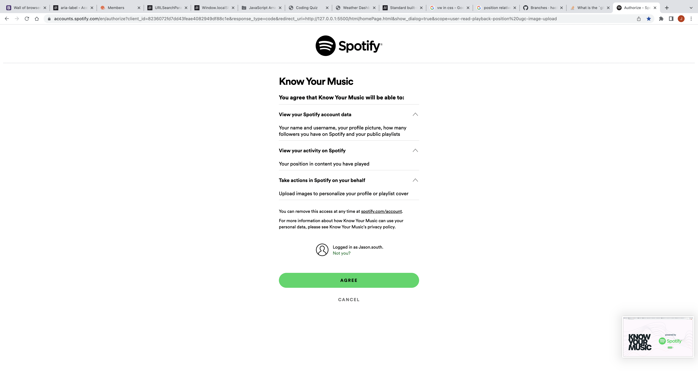

# KnowYourMusic
App that allows users to connect with their favorite artists.

## Justice League of Bootcamp
* 01: Know Your Music
* [Alexander Hacker] | Slack name: [Alexander Hacker] | Github: [hackpres]
* [Jimmy Solis] | Slack name: [Jimmy Solis] | Github: [JimmySolis]
* [Jason South] | Slack name: [Jason South] | Github: [jsouth75]
* [Richard Tran] | Slack name: [Richard Tran] | Github: [rtran1029]
* [Connor Breslin] | Slack name: [Connor Breslin] | Github: [CTBreslin]

## Goal

We have created a website that allows users to connect with their favorite artist's albums and songs. 
Once user is on our initial homepage (index.html) they will be presented with an authorization to link to their Spotify account.  
Once user signs into their Spotify account then they will be redirected to our homePage where they will be given the opportunity to enter an artists name, album, or song.  
Then the user will be presented with the top 5 artists from the API spotify return that best match their input.  This gives the user the option to select the artist of their choice, which will then return the top 10 songs of that artist from the API return.  

<!-- index.html script.js --->
This is our index home page where the user will be asked for authorization to link to their Spotify account.

<!-- Spotify authorization page -->
This is the page the user enters their Spotify credentials, then once confirmed will be redirected to the homePage.html

<!-- homePage.html homePage.js -->
Once user as entered their Spotify credentials they will be redirected to this page (homePage.html) where they can enter artist name or album.

<!-- inputReturns.html inputReturns.js -->
Once they enter an artist name or album then they will be presented with the top 5 API artists results on this page, which they can select the artist of their choice.

<!-- artistPage.html artistPage.js -->
When they select the artist of their choice, then they are presented with the top 10 songs from the API results. 

* Project Github Page: [https://hackpres.github.io/KnowYourMusic/]
* Project Github Repo: [https://github.com/hackpres/KnowYourMusic]
